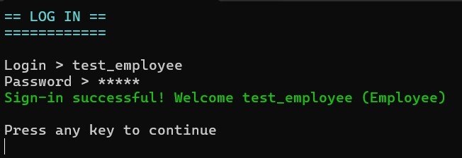
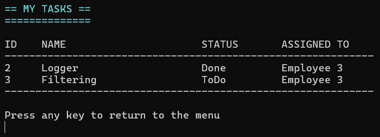
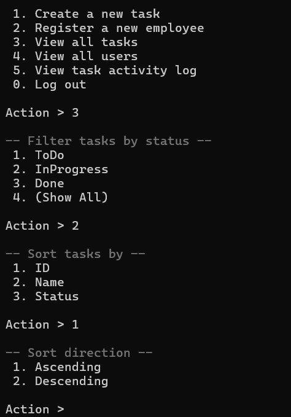
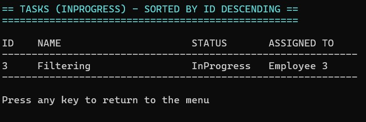
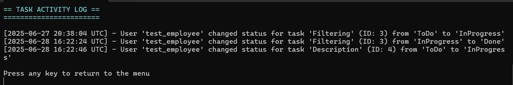

# Console Task Manager

[](https://docs.microsoft.com/en-us/dotnet/csharp/) [](https://dotnet.microsoft.com/)

> **Краткое описание**
>
> Это консольное приложение для управления задачами. Приложение построено на прочном и расширяемом фундаменте

---

### 🔑 Ключевые возможности

-   **Ролевая модель доступа:** Четкое разделение прав между Управляющим (Manager) и Сотрудником (Employee).
-   **Управление задачами:** Управляющий может создавать задачи и назначать их сотрудникам.
-   **Изменение статуса:** Сотрудник может просматривать свои задачи и менять их статус (`ToDo` -> `InProgress` -> `Done`).
-   **Безопасная аутентификация:** Вход в систему по логину и паролю с использованием хеширования (PBKDF2).
-   **Фильтрация и сортировка:** Управляющий может гибко настраивать отображение списка задач.
-   **Логирование действий:** Все изменения статуса задач записываются в отдельный лог-файл, который доступен для просмотра управляющему.

### ✨ Как это выглядит?

<details>
  <summary>Нажмите, чтобы посмотреть скриншоты</summary>
  <br>
  
  *Вход в систему и просмотр задач сотрудником:*
  <p align="center">
    
    
  </p>

  *Процесс фильтрации, сортировки и итоговый результат:*
  <p align="center">
    
    
  </p>
  
  *Просмотр лога активности:*
  <p align="center">
    
  </p>

</details>

### 🛠️ Технологический стек

| Технология | Иконка |
|------------|:------:|
| C#         |  |
| .NET       |  |

### 🏗️ Архитектура и дизайн

Я спроектировал приложение с четким разделением ответственности между слоями. `Program.cs` выступает в роли "дирижера", который инициализирует все компоненты. За взаимодействие с пользователем отвечает UI-слой, за бизнес-логику — сервисы, а за хранение данных — слой доступа к данным.


При разработке я осознанно применял несколько ключевых **паттернов проектирования**:
1.  **Стратегия:** Слой доступа к данным (`IDataStorage`) реализован как стратегия, что позволяет легко заменить JSON на любую другую систему хранения.
2.  **Фасад:** `ConsoleView` выступает фасадом, скрывая за простыми методами всю сложность работы с консолью.
3.  **Фабричный метод:** `ActionHandlerFactory` инкапсулирует логику создания обработчиков для разных ролей, делая систему гибкой.

### 🚀 Как запустить

1.  **Клонируйте репозиторий:**
    ```sh
    git clone https://github.com/YOUR_USERNAME/ConsoleTaskManager.git
    cd ConsoleTaskManager
    ```
2.  **Соберите проект:**
    ```sh
    dotnet build
    ```
3.  **Запустите:**
    ```sh
    dotnet run --project ConsoleTaskManager/ConsoleTaskManager.csproj
    ```
При первом запуске будут созданы учетные данные по умолчанию: `Login: Admin`, `Password: Adminpassword555`.
